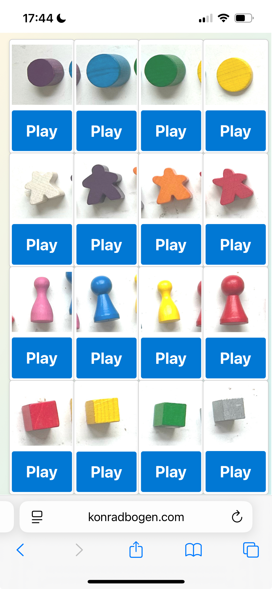

# Playlist

    

This is the accompanying app for my board game PLAYLIST. Visit [konradbogen.com/playlist](https://konradbogen.com/playlist).

_The fun of Memory meets the catchiness of Hitster. Remember the matching musical characters, listen to your favorite music, and keep your orientation!
Music creates a special emotional bond with the game, and matching the characters leads to exciting gameplay — who keeps track? Who makes it harder for the others? Who creates surprising connections?
Through the accompanying web app (no download required!), additional licensed levels can be purchased and tailored to personal taste and difficulty. Beatles fans can play their way through the Beatles catalog, children through the melodies of their favorite Disney movies, classical music lovers can differentiate Bach fugues, and music skeptics or casual players can simply enjoy easily distinguishable levels. The rules are very straightforward, and new levels invite players to come back and play again._

